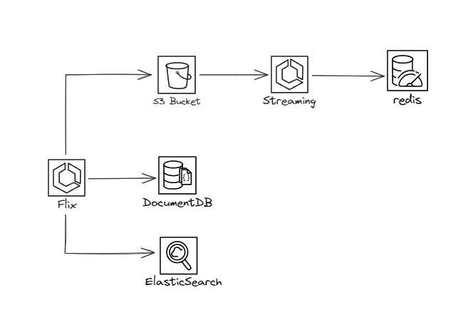

# Streaming video

Aplicação completa para streaming de vídeo, utilizando Spring WebFlux e Spring Boot. Esta solução aborda tanto o fluxo de streaming em tempo real quanto o gerenciamento de informações de vídeos e usuários.
1. **Cadastro e Gerenciamento de Informações**:

    Doc: [Flix](https://github.com/luizpaulino/flix/blob/main/README.md)
    
    Para o cadastro e gerenciamento de informações dos vídeos e usuários, criei um projeto separado utilizando o Spring Boot, atavés do endpoint **/api/users**.

2. **Streaming de Vídeo com Spring WebFlux**:

    Doc: [Streaming](https://github.com/luizpaulino/streaming/blob/main/README.md)
    
    Solução de streaming de vídeo reativa usando o Spring WebFlux.
    Através do endpoint adequado **/streaming/{idVideo}** é possível realizar o streaming de vídeos.

# Por que dois projetos?

A escolha de separar a aplicação de streaming de vídeo em dois projetos distintos, um dedicado ao streaming com Spring WebFlux e outro ao gerenciamento de informações com Spring Boot, é uma abordagem estratégica que traz benefícios significativos para o desenvolvimento, manutenção e escalabilidade do sistema. Aqui estão algumas razões para essa abordagem:

1. **Separação de Responsabilidades**:

    Cada projeto tem uma responsabilidade clara e específica: o primeiro lida exclusivamente com o streaming de vídeo em tempo real, enquanto o segundo gerencia o cadastro e informações dos usuários e vídeos.
    Essa separação facilita o entendimento do código, permitindo que desenvolvedores foquem em áreas específicas sem se preocupar com funcionalidades não relacionadas.

2. **Escalabilidade Independente**:

    Os componentes do sistema podem ser escalados de forma independente, proporcionando flexibilidade operacional. Se a demanda por streaming aumentar, apenas o projeto de streaming pode ser escalado, sem a necessidade de ajustes no gerenciamento de informações e vice-versa.

3. **Manutenção Simplificada**:

    Atualizações e manutenções em um dos projetos não impactam diretamente o outro, desde que a interface de comunicação seja mantida. Isso simplifica a aplicação de correções ou melhorias em um dos módulos sem afetar desnecessariamente o outro.

5. **Tecnologias Específicas**:

    O projeto de streaming pode ser otimizado para aproveitar as características reativas do Spring WebFlux, enquanto o projeto de gerenciamento pode ser configurado de acordo com as necessidades específicas do Spring Boot para operações CRUD e lógica de negócios associada.
    
    Em resumo, a separação da aplicação em dois projetos distintos oferece vantagens consideráveis em termos de escalabilidade e manutenção, contribuindo para uma arquitetura mais robusta e adaptável.

# Tecnoogias utilizadas e desafios de projeto

### Arquitetura do projeto

#### Tecnologias utilizadas

- **Flix:** para o projeto de gestão de informações, utilizei o Spring Boot, por ser apenas uma aplicação de cadastro e gerenciamento de informações, sem necessidade de reatividade e não gerar complexidade desnecessária. De banco de dados, utilizei o MongoDB, por ser um banco de dados não relacional, de fácil configuração e escalabilidade. 
Como mecanismo de busca, utilizei o Elasticsearch, por ser um mecanismo de busca distribuído, de alta performance e escalabilidade, além de ser compatível com o MongoDB. Como sistema de armaezanamento de arquivos, utilizei o Amazon S3, por ser um serviço de armazenamento de objetos simples.

- **Streaming:** para o projeto de streaming do vídeo, utilizei o Spring WebFlux, por ser um framework reativo os arquivos de vídeo estão armazenados no Amazon S3, por ser um serviço de armazenamento de objetos simples. utilizei o DefaultResourceLoader para carregar os arquivos de vídeo do Amazon S3. 
Para contabilizar as visualizações dos vídeos, utilizei o Redis, por ser um banco de dados em memória com TTL configurado em 300 minutos, assim evitando que o número de visualizções seja contabilizado por bots.

#### Desafios de projeto

O grande desafio foi o streaming do vídeo que foi algo que fiz pela primeira vez, e tive bastante dificuldades e fazer os testes unitários com integração mockando o s3.
A arquitetura do projeto também foi um desafio, pois tive que pensar em uma arquitetura que fosse escalável e que pudesse ser facilmente mantida e atualizada.